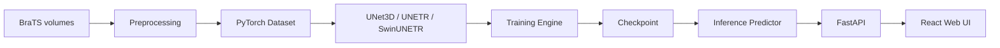

# Architecture

## Core Flow

## Package Boundaries

- `brats_ai.config`: typed experiment configuration.
- `brats_ai.data`: volume loading, preprocessing, case discovery, dataloaders.
- `brats_ai.models`: baseline and transformer model factory.
- `brats_ai.training`: losses and training loop.
- `brats_ai.evaluation`: segmentation metrics.
- `brats_ai.inference`: checkpoint loading and prediction.
- `brats_ai.cli`: audit, train, evaluate, and infer commands.

## Model Strategy

`unet3d` is the baseline for quick iteration. `unetr` and `swinunetr` use MONAI for research-grade transformer segmentation. SwinUNETR is the preferred transformer path for BraTS-style 3D segmentation when GPU memory permits.

